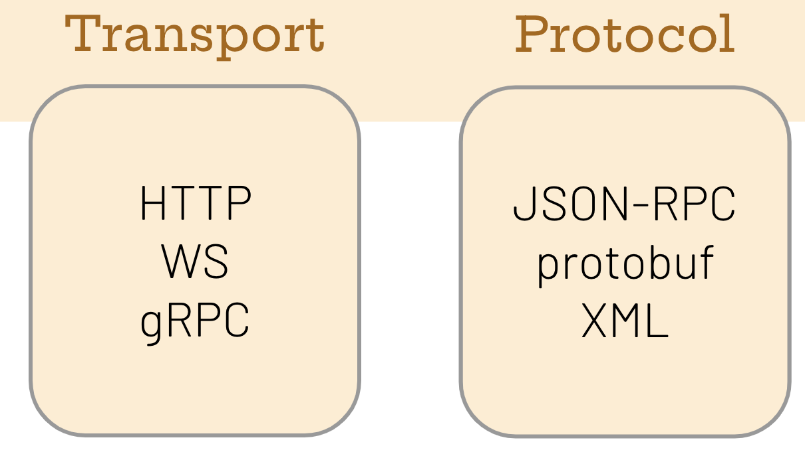

# Querying Hedera Network State - Student Guide

Student guide for module 101-02 of the Hedera Developer Course.

Status: Note that this is still a work in progress.
Materials that are not available yet or incomplete are marked with "(WIP)".

## Overview

This module introduces the concept of network state,
and the various ways in which which we interact with it.

This module demonstrates the various methods to
query data from the current state of the Hedera network.
Namely Mirror Node APIs (programmatic),
JSON-RPC (programmatic), and
Hashscan (visual user interface).

## Learning Outcomes

- [ ] Understand the concept of *state* both in general, and on a blockchain
- [ ] Compare and contrast state interaction concepts
  - Request and response
  - Query and update
  - Transport types
  - Protocol types
  - CQRS
  - Transactions
- [ ] Understand the purpose and functionality of Mirror Nodes, JSON-RPC, and Hashscan in Hedera
- [ ] Appreciate than an additional method of interaction with Hedera state, HAPI, exists
- [ ] Compare and contrast the different JSON-RPC endpoints available

**Practical**

- [ ] Issue a CLI instruction to query Hedera Testnet using the Mirror Node API
- [ ] Run a NodeJs script to query Hedera Testnet using the Mirror Node API
- [ ] Look up a JSON-RPC endpoint URL for Hashio
- [ ] Set up a JSON-RPC endpoint URL via 3rd party providers
- [ ] Set up a JSON-RPC endpoint URL via Hedera JSON-RPC Relay
- [ ] Issue a CLI instruction to query Hedera Testnet using JSON-RPC
- [ ] Run a NodeJs script to query Hedera Testnet using the JSON-RPC
- [ ] Browse Hashscan in browser to query Hedera Testnet using a browser

## Self Assessments

**Fill in the blanks**

In blockchains, state can be ____ using a query and be ____ using a transaction.
All state ____ must be agreed upon by ____ in the blockchain network.
They do so using a ____ algorithm.

**Answer the following questions**

When a blockchain node receives a transaction,
what does it need to do to determine
if that transaction should be added to the blockchain?

____

How do blockchain networks implement CQRS?

____

**Classify the following terms into their categories**

JSON-RPC, XML, HTTP, WS, protobuf, gRPC


## Code Snippets

JSON-RPC request body to retrieve the latest block.
Note that you should use `JSON.stringify` to use as input into an HTTP request.

```js
  {
    method: 'eth_getBlockByNumber',
    params: ['latest', false],
    'id': 1,
    'jsonrpc': '2.0',
  }
```

Issue an HTTP `POST` request to a JSON-RPC endpoint at `rpcUrl`.

```js
  await fetch(
    rpcUrl,
    {
      method: 'POST',
      headers: {
        'Content-Type': 'application/json',
      },
      body: jsonRpcRequestBody,
      redirect: 'follow',
    },
  );
```

## Definitions

- **Hedera** - A layer 1 blockchain that is EVM compatible (HSCS), and additionally features a message queue (HCS) plus native tokens (HTS).
- **Private Key** - In cryptography, a private key can be used for creating digital signatures and encryption. In blockchains, including Hedera, private keys are primarily used for signing transactions.
- **Public Key** - In cryptography, a public key is the counterpart of a private key, and it can be used for verifying signatures, and decryption. In blockchains, including Hedera, public keys are primarily used for verifying transaction signatures.
- **JSON-RPC** - A protocol for requests and responses, originally used in Ethereum and now adopted by all EVM-compatible blockchain networks including Hedera. These *remote procedure calls** (RPCs) are serialised using JSON, and transported using HTTP. Each one includes a RPC name, and a list of parameters that is specific to each RPC.
- **Mirror Node** - A server that stores all historical transactions on the Hedera Network. Also exposes a *Mirror Node API* which allows network state to be queried (but not updated).
- **Hashscan** - A network explorer for the Hedera network. It is a browser based applications that displays information about the network queried using the Mirror Node API.
- **HAPI** - Native Hedera APIs. These are serialised using protobufs and transported over gRPC. The Hedera SDKs make it possible to use HAPIs using a number of high-level languages, including Javascript, Java, Go, and others.

## Resources

- [Hedera Documentation](https://docs.hedera.com/hedera)
- [Hedera Mirror Node REST API (Testnet)](https://testnet.mirrornode.hedera.com/api/v1/docs/)
- [JSON-RPC API (Ethereum)](https://ethereum.org/en/developers/docs/apis/json-rpc/)
- [Hedera RPC (QuickNode)](https://www.quicknode.com/docs/hedera)
- [Guide to JSON-RPC connections on Hedera](https://docs.hedera.com/hedera/tutorials/more-tutorials/json-rpc-connections/)
- [`curl`](https://curl.se/) -
  a CLI tool used in this module to make HTTP requests
- [`fetch`](https://developer.mozilla.org/en-US/docs/Web/API/Fetch_API/Using_Fetch) -
  a guide to using `fetch` to make HTTP requests in Javascript
- Blockchain state, as defined in the [Ethereum Yellow Paper](https://ethereum.github.io/yellowpaper/paper.pdf)
  - "[a blockchain] can be viewed as a transaction-based state machine: we begin with a genesis state and incrementally execute transactions to morph it into some current state. It is this current state which we accept as the canonical version [of the blockchain]"
- Blockchain state, as defined by Amrit Kumar. [DApps Dev Club Session 5 Round Up](https://dappsdev.org/blog/2019-05-02-dapps-dev-club-5th-session-roundup/)
  - "[blockchains] are stateful systems. This basically means that a [blockchain] at any point of time can be said to be in a particular "state". ... A state transition is a function that allows users to change the state of the [blockchain]"
- [What is a blockchain transaction?](https://www.web3labs.com/blockchain-explained-what-is-a-blockchain-transaction)
  - "A transaction represents an action taking place on a blockchain network."

## Self Assessment Answers

**Fill in the blanks**

In blockchains, state can be _read_ using a query and be _updated_ using a transaction.
All state _changes_ must be agreed upon by _nodes_ in the blockchain network.
They do so using a _consensus_ algorithm.

**Answer the following questions**

When a blockchain node receives a transaction,
what does it need to do to determine
if that transaction should be added to the blockchain?

_The transaction data itself must be validated. The transaction authorisation must also be validated, and this is typically done by matching the cryptographic signature attached to the transaction._

How do blockchain networks implement CQRS?

_In command-query responsibility segregation (CQRS), commands update the state of the network, and queries do not. In blockchains, transactions are used for commands, and queries do not use transactions, thereby allowing blockchain nodes to explicitly segregate the handling of commands and queries._

**Classify the following terms into their categories**

JSON-RPC, XML, HTTP, WS, protobuf, gRPC


